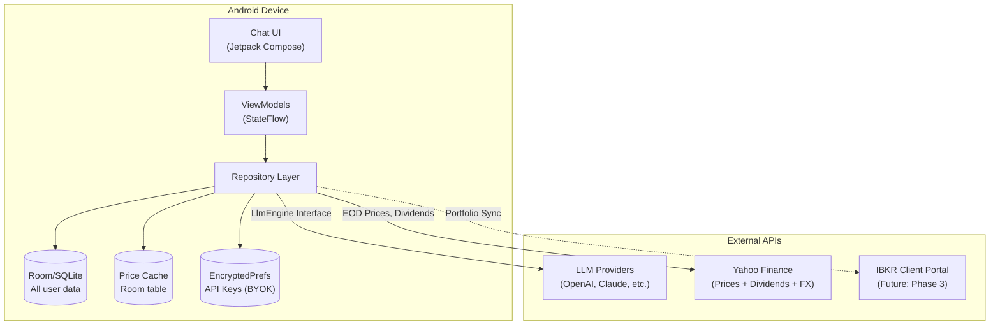
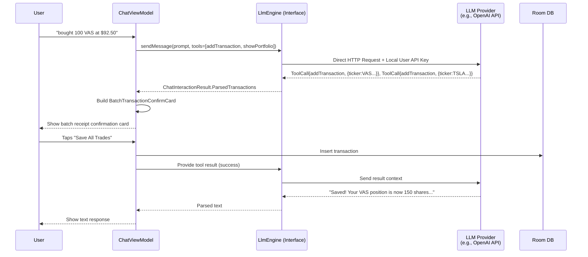
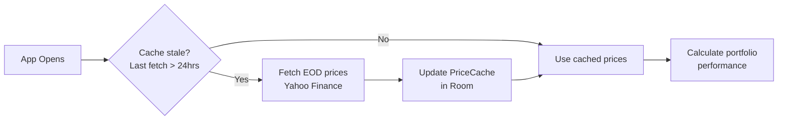
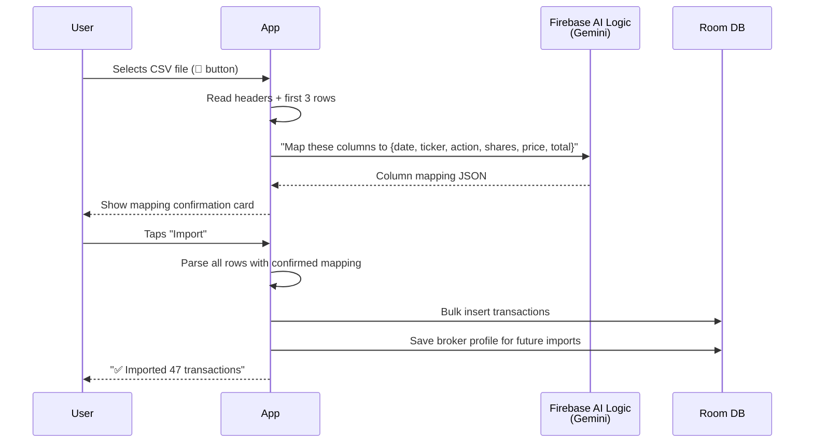
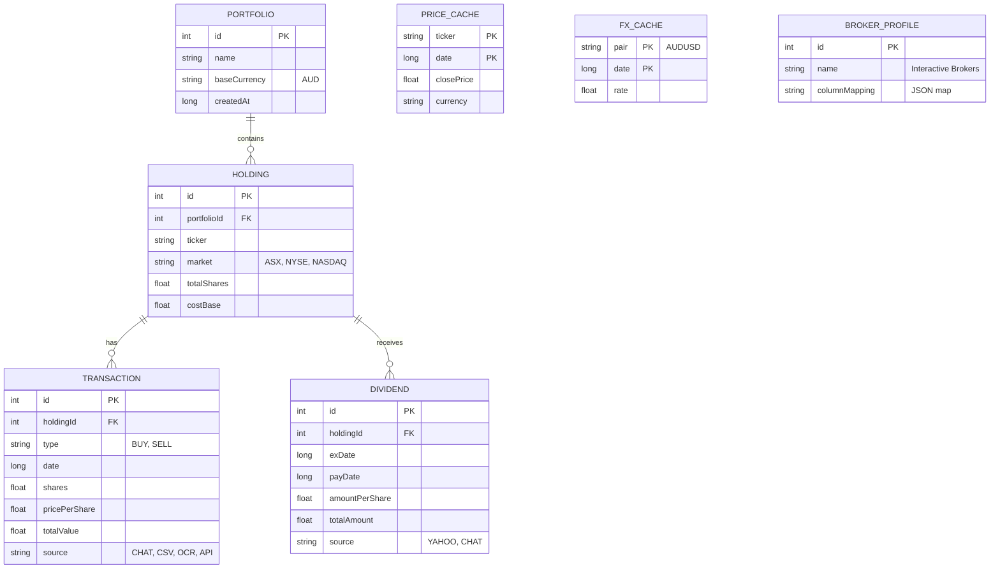
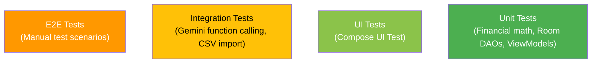
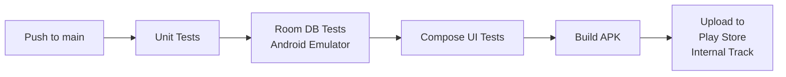

# Design Doc: ChatFolio Android Architecture

## 1. Overview

**ChatFolio Android** is a local-first, chat-driven portfolio tracker. All user data lives on-device in Room/SQLite. The app communicates directly with external APIs (Gemini for AI, Yahoo Finance for prices) — there is no backend server.

The entire user experience is a single chat screen where the AI responds with text or rich **adaptive cards** (charts, tables, confirmation dialogs) embedded inline.

## 2. System Architecture



## 3. Core Modules

### 3.1. Chat UI (Jetpack Compose)

- **Single screen:** Chat message list + text input + attachment button (CSV/photo)
- **Settings screen:** AUD base currency, data export, about
- **Navigation:** None. The chat *is* the app.
- **State management:** `ChatViewModel` exposes `StateFlow<List<ChatMessage>>`

### 3.2. Adaptive Card System

The AI decides when to respond with a card vs plain text. Cards are Compose composables rendered inline in the chat message list.

```kotlin
sealed class ChatContent {
    data class Text(val markdown: String) : ChatContent()
    data class PortfolioSummaryCard(val data: PortfolioSummary) : ChatContent()
    data class HoldingsTableCard(val holdings: List<Holding>) : ChatContent()
    data class PerformanceChartCard(val dataPoints: List<DataPoint>) : ChatContent()
    data class AllocationDonutCard(val allocations: List<Allocation>) : ChatContent()
    data class TransactionConfirmCard(val transaction: Transaction) : ChatContent()
    data class DividendSummaryCard(val dividends: List<Dividend>) : ChatContent()
    data class StockDetailCard(val stock: StockDetail) : ChatContent()
}
```

**Chart rendering:** Vico library (line charts, donut charts). Composable cards with fixed height embedded in `LazyColumn`.

### 3.3. Generic AI Engine (LlmEngine via BYOK)



**Key design decisions:**
- **Authentication (BYOK):** Users provide their own API key (Bring Your Own Key) in the Settings screen.
- **Security:** API keys are encrypted and stored locally using Android `EncryptedSharedPreferences`. They never leave the device except to directly ping the provider's API.
- **Agnostic Interface:** `ChatViewModel` only talks to the generic `LlmEngine` interface. Implementations (like `OpenAiEngine` or `ClaudeEngine`) handle the specific HTTP structures using Ktor Client.
- **Function declarations:** Standard tool schema passed to the model: `addTransaction`, `getPortfolio`, `getHoldings`
- **Context injection:** Before each chat turn, inject a portfolio summary as system context.

### 3.4. Market Data Engine



- **Yahoo Finance:** Unofficial REST endpoints, rate limit ~2,000 req/hr per IP
- **Fetch strategy:** Once per ticker per day (EOD). 50-stock portfolio = 50 calls/day
- **Dividend data:** Yahoo provides dividend history (amount + ex-date) per ticker
- **FX rates:** AUD/USD rate fetched once daily, cached locally
- **Fallback:** If Yahoo is unavailable, use last cached price; show "as of [date]"

### 3.5. CSV Import Engine



**Pre-built profile:** Interactive Brokers Activity Statement CSV format (hardcoded column mapping, bypasses Gemini step).

## 4. Data Schema (Room Entities)



## 5. Security & Privacy

| Layer | Implementation |
|---|---|
| **Data at rest** | Room/SQLite on device (Android file-system encryption) |
| **Sensitive settings** | `EncryptedSharedPreferences` (Stores User's Gemini API Key) |
| **LLM communication** | Generic Google GenAI SDK — direct device-to-Google HTTP request |
| **Market data** | Direct HTTPS to Yahoo Finance — no PII sent |
| **Data sent to Gemini** | Portfolio summary (tickers, quantities, values) for context. No account numbers, passwords, or personal identity data |
| **Backup/export** | User-initiated JSON export. Encrypted with user-provided passphrase |

## 6. Screen Architecture

```
┌──────────────────────────────┐
│  ChatFolio              ⚙️   │  ← App bar + settings icon
├──────────────────────────────┤
│                              │
│  🤖 Welcome! I'm your       │
│     portfolio analyst.       │
│     Try "show my portfolio"  │
│                              │
│  👤 bought 100 VAS at $92   │
│                              │
│  🤖 ┌─────────────────────┐ │
│     │ ✅ Confirm Trade      │ │  ← TransactionConfirmCard
│     │ BUY 100 × VAS @$92  │ │
│     │ Total: $9,200.00     │ │
│     │ [Save] [Edit] [❌]   │ │
│     └─────────────────────┘ │
│                              │
│  👤 how's my portfolio?     │
│                              │
│  🤖 ┌─────────────────────┐ │
│     │ 📊 Portfolio Summary  │ │  ← PortfolioSummaryCard
│     │ $47,250  ▲ 1.2%      │ │
│     │ ───────[sparkline]── │ │
│     │ Today: +$562.10      │ │
│     └─────────────────────┘ │
│                              │
├──────────────────────────────┤
│  [Type a message...]   📎 ↑ │  ← Input + CSV/photo attach
└──────────────────────────────┘
```

**Total screens: 2** — Chat (main) + Settings

## 7. Testing Architecture

### Testing Pyramid



### Layer 1: Financial Calculation Unit Tests

The most critical layer. All portfolio math must match hand-verified spreadsheet values.

```kotlin
// Example test cases
class PortfolioCalculatorTest {
    @Test fun `cost basis after multiple buys at different prices`()
    @Test fun `total return including dividends`()
    @Test fun `gain-loss percentage with partial sells`()
    @Test fun `FIFO cost basis after partial sell`()
    @Test fun `portfolio value with mixed AUD and USD holdings`()
    @Test fun `daily change calculation with stale vs fresh prices`()
}
```

**Tooling:** JUnit 5, Truth (assertions)

### Layer 2: Room Database Tests

Instrumented tests running on Android device/emulator with an in-memory database.

```kotlin
class TransactionDaoTest {
    @Test fun `insert and retrieve transaction`()
    @Test fun `bulk insert from CSV import updates holdings`()
    @Test fun `delete transaction recalculates holding cost basis`()
    @Test fun `migration from v1 to v2 preserves data`()
}

class HoldingDaoTest {
    @Test fun `holdings aggregated correctly across transactions`()
    @Test fun `dividend total for holding within date range`()
}
```

**Tooling:** AndroidX Test, Room in-memory DB

### Layer 3: Gemini Function Calling Tests

Integration tests verifying that Gemini correctly extracts structured data from natural language. Use recorded prompt-response pairs to avoid live API calls in CI.

```kotlin
class TradeParsingTest {
    @Test fun `parses simple buy`()
    // Input: "bought 100 VAS at $92.50"
    // Expected: FunctionCall{addTransaction, {ticker:VAS, action:BUY, shares:100, price:92.50}}

    @Test fun `parses sell with date`()
    // Input: "sold 50 AAPL at $180 on March 10"

    @Test fun `parses dividend entry`()
    // Input: "received $120 dividend from VHY on Feb 28"

    @Test fun `handles ambiguous input gracefully`()
    // Input: "I think I bought some shares last week"
    // Expected: AI asks for clarification, no FunctionCall
}

class CsvMappingTest {
    @Test fun `maps IB Activity Statement columns correctly`()
    @Test fun `maps unknown broker CSV via Gemini`()
    @Test fun `reuses saved broker profile`()
}
```

**Tooling:** JUnit 5, recorded Gemini responses (JSON fixtures), Mockk for Firebase SDK

### Layer 4: Compose UI Tests

Verify card rendering and chat interaction flows.

```kotlin
class ChatScreenTest {
    @Test fun `displays portfolio summary card with correct values`()
    @Test fun `transaction confirm card shows Save and Edit buttons`()
    @Test fun `tapping Save on confirm card triggers insert`()
    @Test fun `chat input sends message and shows AI response`()
    @Test fun `CSV attach button opens file picker`()
}
```

**Tooling:** Compose UI Test, Turbine (Flow assertion)

### Layer 5: End-to-End Test Scenarios

Manual test scripts run before each release:

| Scenario | Steps | Expected |
|---|---|---|
| **First-time trade** | Open app → type "bought 50 VAS at $90" → tap Save | Holding appears, portfolio value = $4,500 |
| **CSV import (IB)** | Attach IB Activity Statement CSV → confirm mapping → import | All transactions imported, holdings match CSV totals |
| **Price refresh** | Add holding → wait for EOD fetch | Current price populated, gain/loss calculated |
| **Dividend tracking** | Type "received $50 dividend from VAS" → Save | Dividend card shows in chat, total dividends updated |
| **Data persistence** | Add trades → force-kill app → reopen | All data intact |
| **Offline mode** | Enable airplane mode → ask "show my portfolio" | Uses cached prices, shows "as of [date]" |

### CI Pipeline



**Tooling:** GitHub Actions, Gradle managed devices (for instrumented tests without physical device)

## 8. Technology Stack

| Layer | Technology |
|---|---|
| UI | Jetpack Compose, Material 3 |
| State | ViewModel + StateFlow |
| Database | Room (SQLite) |
| Networking | Ktor Client (Kotlin) |
| AI Inference | Generic `LlmEngine` (BYOK via Ktor and EncryptedPrefs) |
| Charts | Vico |
| DI | Hilt |
| Background | WorkManager (price refresh) |
| Testing | JUnit, Compose UI Test, Turbine (Flow testing) |

## 8. Deployment

- **Distribution:** Google Play (APK/AAB)
- **Backend:** None. Zero server infrastructure.
- **Firebase:** REMOVED to support BYOK and prevent unmetered developer cloud bills.
- **CI/CD:** GitHub Actions — build, test, deploy to Play Store
